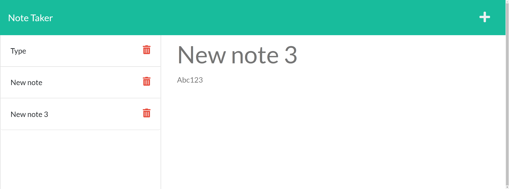

# Notes to Go

## Description

A dynamic web page that allows users to create notes for later, save them and make edits to existing notes

## Built With the following Technologies

HTML, CSS, Javascript, Node

## Contributor

Joshua Aldrich

## Link to repository

https://github.com/JoshuaAldrich/Note-Taker

### Contact

If you need to message me contact me at joshuataldrich@gmail.com or find my projects at github.com/JoshuaAldrich

